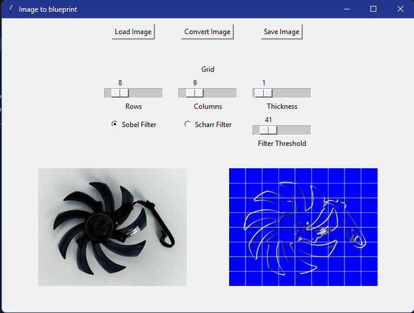
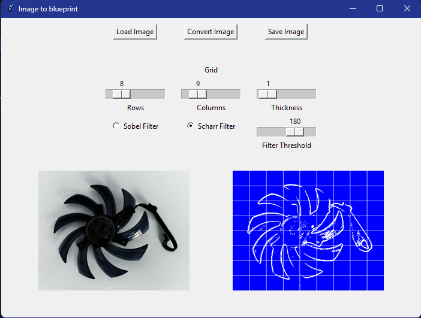

# Image-to-Blueprint
Convert images to blueprints

Applies a Sobel or Scharr filter then changes the black color to blue. Use the sliders to configure the grid pattern

The Sobel filter is applied using these kernels for vertical and horizontal edge detection, then added together.
|  1 |  0 | -1 |
|----|----|----|
|  2 |  0 | -2 |
|  1 |  0 | -1 |

|  1 |  2 |  1 |
|----|----|----|
|  0 |  0 |  0 |
| -1 | -2 | -1 |

The Scharr filter is similar but the kernels produce stronger edges

|  3 |  0 | -3 |
|----|----|----|
| 10 |  0 | -10 |
|  3 |  0 | -3 |

|  3 | 10 |  3 |
|----|----|----|
|  0 |  0 |  0 |
| -3 | -10| -3 |

